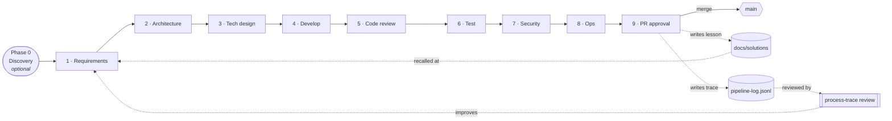

# gated-pipeline

**Turn a coding agent into a disciplined delivery team — and make it smarter with every unit of work.**

[](LICENSE)
[](https://claude.com/claude-code)
[](#no-runtime-nothing-to-deploy)
[](#quickstart)

Most "AI dev workflow" tools give your agent a checklist. `gated-pipeline` gives it a **process with teeth** — nine review gates it can't skip, real CI enforcement, typed hand-offs, and two feedback loops that make the *next* task easier than the last. It's plain Markdown the harness loads deterministically. Nothing to host, nothing to pay for, every step visible in a `git diff`.

Extracted from a real production codebase. Battle-tested, then generalized.

---

## Why this exists

Left alone, a coding agent sprints straight to code, forgets what it learned yesterday, and quietly ships the bug your architecture was supposed to prevent. Skill libraries help — but they *suggest*; they don't *enforce*, and they don't *compound*.

`gated-pipeline` is opinionated on purpose:

- **It enforces.** Tests, SAST, dependency audit, structural boundaries, and a `block-push-to-main` hook are *blocking*, and every gate pastes its evidence into the PR. No rubber stamps.
- **It compounds.** Every unit distills its lesson forward and its execution-trace backward — so the pipeline gets sharper over time instead of just running.
- **It scales to the work.** Risk-tiered profiles and model tiers spend ceremony (and tokens) where they matter and get out of the way where they don't.

## Quickstart

In the root of a Git repo:

```bash
npx gated-pipeline
```

It scaffolds `.claude/` and a `docs/` skeleton, asks for your project name and stack, and never overwrites your files. Non-interactive:

```bash
npx gated-pipeline --slug=my-app --name="My App" --coauthor="Claude <noreply@anthropic.com>"
```

Then open `STACK.md` (your one adaptation file), skim `docs/PROCESS.md`, and run your first unit through the gates.

## The flow



**Discovery** widens the option space before you commit. **Gates 1–9** carry the work from a testable requirement to a merged, evidenced PR. **On merge**, two loops close: the *lesson* flows forward into future planning, and the *trace* flows into a periodic review that tunes the pipeline itself.

## What you get

**A nine-gate delivery pipeline** — `requirements → architecture → design → develop → code-review → test → security → ops → approval`. Each gate is an agent persona driven by a card, exiting an explicit `GATE / RESULT / ARTIFACT / SUMMARY / HANDOFF` block. Gates 1–3 may no-op for mechanical changes; 4–9 never skip.

**An optional discovery phase** — a divergent front-end (brainstorm, field-scan, argue the do-not-build case) that *feeds* requirements for genuinely new features, and gets out of the way for the rest.

**A cadence review suite** — periodic, report-only reviews that catch what per-PR gates miss: tech-debt, SEO, performance-drift, dependency-currency/CVE (every 10 merges) and accessibility (every 5). Findings graduate back through the gates.

**Two self-improvement loops** — the part nobody else has:
- **Knowledge compounding** — each unit's reusable lesson is distilled to `docs/solutions/` at merge and recalled at planning. *Each unit makes the next easier.*
- **Tracing & metrics** — every merge appends a structured line to `docs/traces/pipeline-log.jsonl`; a cadence agent computes catch-rate, rework, **escape rate**, and profile/tier calibration, then recommends evidence-based changes to the pipeline.

**The machinery that makes it real:**

| | |
|---|---|
| **Gate profiles** | `full` / `docs` / `chore` — scale ceremony to change risk |
| **Model tiers** | the strong model for judgment gates, a cheaper one for verification |
| **Typed hand-offs** | a machine-readable JSON mirror of every exit block — routable, auditable |
| **File-based memory** | per-agent `inbox` + `memory`, committed and greppable — no runtime, no vector DB |
| **Structural lint** | architectural-boundary enforcement (layer purity, no cycles) — beyond style + types |
| **Verification fan-out** | an optional parallel-review workflow for the mechanical gates |
| **Deterministic loading** | rules load by the harness, not by an obedience ritual |
| **`block-push-to-main`** | a hook that enforces the PR-only workflow |

## No runtime. Nothing to deploy.

It's Markdown, a manifest, and a tiny installer. No service, no database, no vendor, no per-token bill beyond the model you already use. Every gate, decision, and trace lives in your repo and shows up in a normal `git diff` — the opposite of a black box.

## Use it across projects, keep it current

Install once, then pull framework improvements without losing your customizations:

```bash
pnpm add -D github:wrwatkins/gated-pipeline
pnpm gated-pipeline sync      # updates framework files in place; never touches your STACK.md / docs / protected cards
```

The [`framework-manifest.json`](framework-manifest.json) splits *framework* files (owned here, updated on `sync`) from *project* files (yours, forever). A fix to a gate card lands in every project on its next sync — and you review the diff, always. No submodule, no hidden state.

## How it compares

Skill libraries and plugins (BMAD, and the Claude Code skill ecosystems) optimize for **ergonomics and reuse** — lightweight, plugin-native, auto-triggered. `gated-pipeline` optimizes for **rigor, enforcement, and auditability**, and it's the one that **compounds**. If you're shipping something real and want the discipline to *accrue*, this is the trade you want. Start generic, tailor via one file, and let the pipeline get smarter as you go.

## Adapt it to your stack

Everything project-specific lives in **[`STACK.md`](template/STACK.md)** — commands, test tiers, core invariants, guardrails, sensitive fields, governance, budgets. The gate cards ship as a worked example (TypeScript / Next.js / pnpm) you adapt there; [`GENERALIZATION-NOTES.md`](GENERALIZATION-NOTES.md) maps exactly what to change.

## License

MIT — see [LICENSE](LICENSE). Built with [Claude Code](https://claude.com/claude-code).
